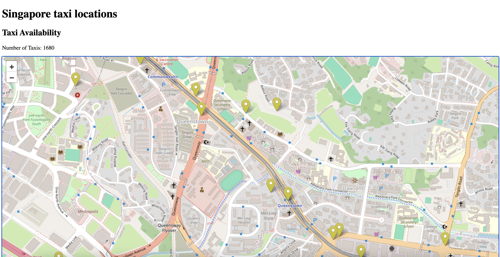
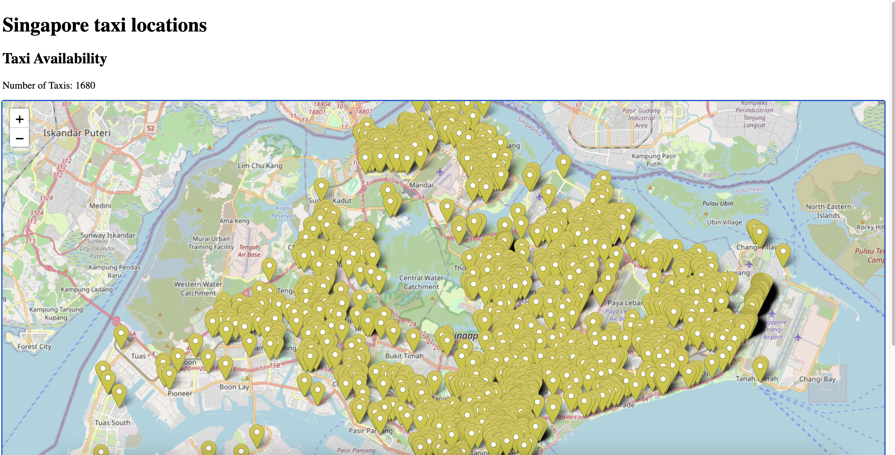

# Singapore Taxi Locations

## Description
The app displays the live locations of Singapore taxis. Data is obtained from the Land Transport Authority (LTA)'s Datamall. The locations are updated every 30 seconds.  

[Taxi live API](https://beta.data.gov.sg/datasets/d_e25662f1a062dd046453926aa284ba64/view)

The app is developed using JavaScript, HTML and Leaflet.js

## To use
1. Clone the repository
2. Launch index.html 

